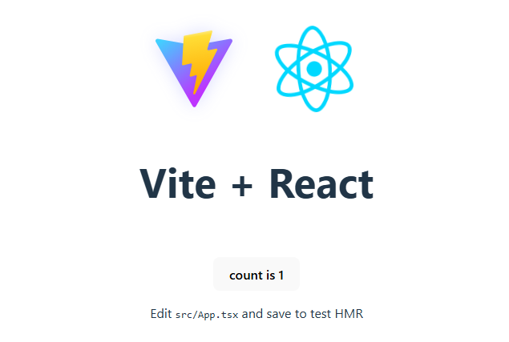

# Amplfy and Vite | React template in .ts

Here are the steps to getting your lightweight amplify setup with a super simple front end

The main parts are from the Aplify Doc's found [here](https://docs.amplify.aws/react/start/manual-installation/)

You'll need
- AWS account
- Github connection
- Code editor such as VS or Gitpod

## Step 1 - Install Amplify

Run this code in your editor and proceed with the installation instructions.  You'll get all the files and structure you need to get set up.

```sh
npm create amplify@latest
```

Once complete you'll see "Welcome to Amplify" and suggestions to run the sandbox.  But just wait before we do anything else I suggest you set up a simple front end.

Lets load up Vite and React using this code

```sh
npm create vite@latest . -- --template react-ts
```

Proceed with the installation instructions and ignore any files and continue.

Next we just need to run the following code to get all our packages uploaded.

```sh
npm install
```

From this point I'm eager to get designing with ```npn run dev``` however I suggest we add a few files and then go with the git commands to push everything up.

Next we'll update the vite.config.ts file with the following.  You'll find this file at the bottom of all your files in the root section.

```ts
import { defineConfig } from 'vite'
import react from '@vitejs/plugin-react'

export default defineConfig({
  plugins: [react()],
  base: './', // Ensures relative paths for assets
  build: {
    outDir: 'dist',
    assetsDir: 'assets', // Ensures assets are correctly placed
  },
  server: {
    strictPort: true,
  },
})

```

With that set up next we'll make our ```amplify.yml``` file also in the root section with the following code.

```yml
frontend:
  phases:
    preBuild:
      commands:
        - npm ci
    build:
      commands:
        - npm run build
  artifacts:
    baseDirectory: dist
    files:
      - '**/*'
  cache:
    paths:
      - node_modules/**/*

```

Great, now we can push it up and then we'll move to the Aplify section in AWS.

```sh
git add .
git commit -m "manual setup"
git push origin main
```

Here you'll need to link your Github with Amplify.  There will be an authorization check and once thats ok we can run ```Deploy``` with all the default settings.

You should see this below from your Domain that was created by Amplify.

